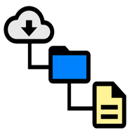

<div margin="auto">
</img>
</div>

# MD Notes

This application allows you to view the contents of a specific shared folder on a server, directly on your smartphone.

</img>

*MD Notes* is provided with a **server-side application**, with which to share the contents of a folder, and a **client-side application** with which to interface and view the contents.

Actually, the only file extensions supported are:

- `.md` markdown
- `.png` image
- `.jpg` image

* * *

## Server application

As mentioned before, *MD Notes* provides a **server-side application**, with which to share the contents of a folder.

This server application is located in the `server` folder.
Inside this folder there is the `data` folder, which contains the contents you want to share.

The structure of the `server` folder is the following

```
server
├── data
├── .env
├── .gitignore
├── index.js
├── node_modules
├── package.json
└── package-lock.json
```

### Custom preferences

You can customize the location of `data` folder, or the `port` where the server service will run.

You can set you preferences by modifying the `.env` file.

```
PORT=[port number]
DATA_DIR=[your data folder path]
```

The default values are:

- `PORT`: 7867
- `DATA_DIR`: data

### Server Installation

The software required in your system are:

- npm
- node

After you install the previous dependencies, go in `server` folder and install all node modules

```bash
cd server
npm i
```

Now install the last dependency `forever`, a simple CLI that allows you to run scripts continuously as a deamon.

```bash
[sudo] npm install forever -g
```

Now start the server process with the following command

```bash
forever start index.js
```

**NOTE:** if you prefer, you can use an other tool to run the server application.

* * *

## Client Installation

* * *

## Future Features

- [x] add app icon logo.
- [ ] others file extensions support.
- [ ] security layer with login.
- [ ] edit mode for file editing.
- [ ] manage files via smartphone application.
